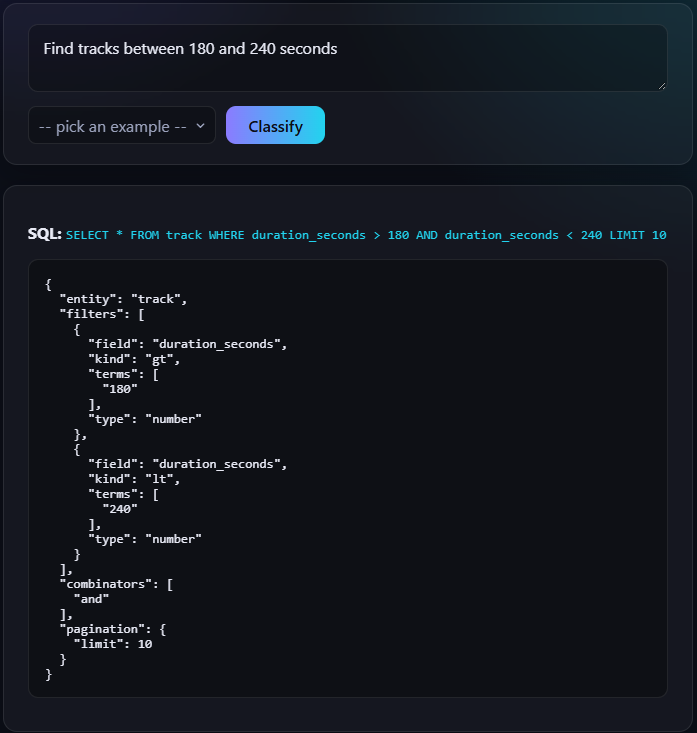
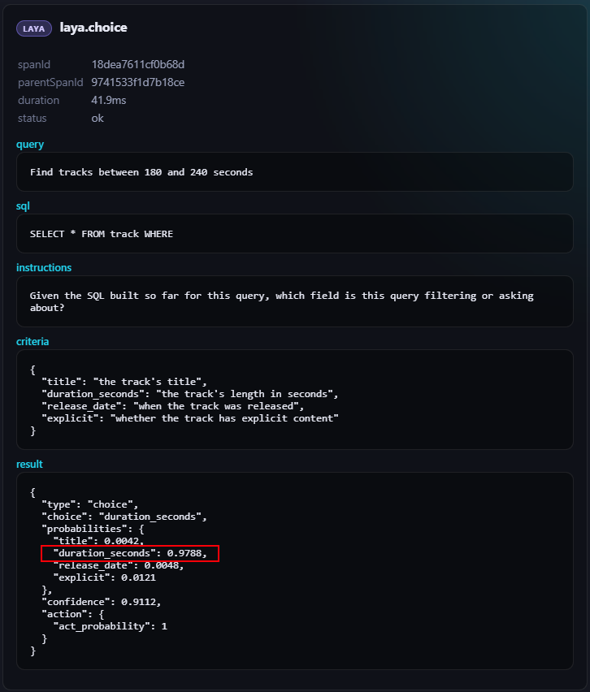
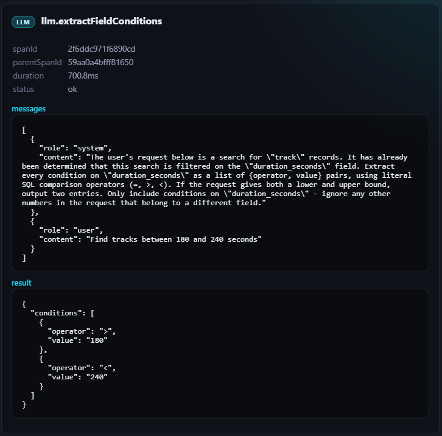

# query-classifier

Turns a human search request into a structured request that might be used downstream by the deterministic pipeline.

Using:
 - [laya](https://github.com/NandhaKishorM/laya) for closed-set classification. 
 - A small local LLM (qwen3.5:0.8b by default) only for genuine free-text extraction.

| Example |
|---|
|  |

Domain-agnostic: 
- Entity and field definitions live in JSON config files.
- There are predefined domains to represent an idea: `shop` and `music`.

## The problem

| | |
|---|---|
| Input | a natural-language search request |
| Output | a typed filter object + SQL rendering |
| Constraint | fully local — no cloud LLM, no data leaves the machine |

The hard part on a local budget: closed-set decisions (which entity? which field? which
operator?) are exactly what a small LLM is worst at. This project splits the work so each
decision goes to the model that handles it best.

Every sub-question is a recorded span nested under its pipeline stage, so you can see exactly
which call went to which model:

| laya — closed-set sub-questions, ~33ms each | text LLM — free-text extraction only |
|---|---|
|  |  |

## How it's configured

```
domains/
  <name>.json           entities, fields, types, descriptions, out-of-scope text
  <name>.examples.json  quick-pick examples + expected filter shape (also benchmark fixtures)
```

Adding a domain = write two JSON files, run `bun run generate:schema`, rebuild. The pipeline
code has no domain-specific text in it.

## Quick start

```bash
# prerequisites: ../laya service + local ollama with qwen3.5:0.8b (see docs/running.md)
cd ../laya && docker compose -f compose.yaml -f compose.serve.yaml up -d --build && cd -

bun install
bun run dev:api      # http://localhost:3001
bun run dev:client   # http://localhost:3000 (manual-test UI)

bun test             # unit tests, mocked clients
bun run benchmark    # accuracy report vs fixtures
```

```bash
curl -X POST localhost:3001/classify \
  -H 'content-type: application/json' \
  -d '{"query": "products under 50 dollars", "domain": "shop"}'
```

## Main idea under the hood

A stage pipeline where every decision goes to the cheapest model that can make it:

```
query → entity → field → kind → no-filter → value → limit → clarification
              laya (encoder, ~33ms)        small LLM (free text only)
```

- **laya** — a ModernBERT encoder classifier, not a generative model. Handles all closed-set
  choices: entity, field, operator. ~33ms per call, no generation.
- **small local LLM** — only for what laya structurally can't do: extracting free-text values
  (emails, dates, numbers, limits).
- **SQL-string framing** — every laya call is phrased as a question about a concrete SQL WHERE
  clause being built, not about the raw query. This framing was measured to beat every
  abstract/meta alternative tried.
- **Per-stage scoping** — each laya call sees only the options legal at that point (one
  entity's fields, only operators legal for that field's type). Fewer options = higher accuracy;
  measured at 89% vs 53% and 86% vs 63% for the two biggest calls.

The distilled rules for writing laya calls — what works, what was tried and rejected, with
evidence — are in [`docs/laya-guidelines.md`](docs/laya-guidelines.md).

> **About the SQL:** it's scaffolding, not the product. laya and the LLM both reason better
> about a concrete `WHERE` clause than about a raw sentence, so the pipeline renders the filter
> built so far as SQL and feeds *that* into the prompts. The real output is the structured
> request — `{entity, filter, pagination}` — never a query to execute.

## Docs

| Doc | Contents |
|---|---|
| [`docs/laya-guidelines.md`](docs/laya-guidelines.md) | How to phrase laya calls — the evidence trail |
| [`docs/architecture.md`](docs/architecture.md) | Repo layout, pipeline, API surface |
| [`docs/domain-config.md`](docs/domain-config.md) | Domain JSON files, generated schema, typing decisions |
| [`docs/running.md`](docs/running.md) | Prerequisites, tests, benchmark, dev servers |
| [`docs/benchmark.md`](docs/benchmark.md) | How benchmarking works + current numbers |
| [`docs/known-issues.md`](docs/known-issues.md) | Open bugs and measured model limits |

## Known issues

- Kind-decision (operator choice) sits at a measured ~86% ceiling for the local model — not a
  bug.
- The no-filter check can silently produce `kind=all` after inheriting a wrong field.
- The ollama range extractor hallucinates off-by-one values on some `music` phrasings
  ("more than 50 tracks" → `51`).
- Clarification is implemented but not wired into the default pipeline.

Details and repro steps: [`docs/known-issues.md`](docs/known-issues.md).

## Roadmap

- [ ] Reduce detection misjudgements — push the per-stage accuracy (kind decision ~86%, music domain 69%) up by refining laya call phrasing and scoping
- [ ] Add ordering recognition — parse "sort by X" / "newest first" phrasings into `ORDER BY` in the structured output
- [ ] Try a fine-tuned laya version for this scenario — a checkpoint fine-tuned on SQL-framed classification data instead of the off-the-shelf encoder
