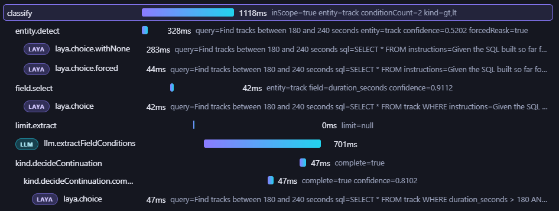
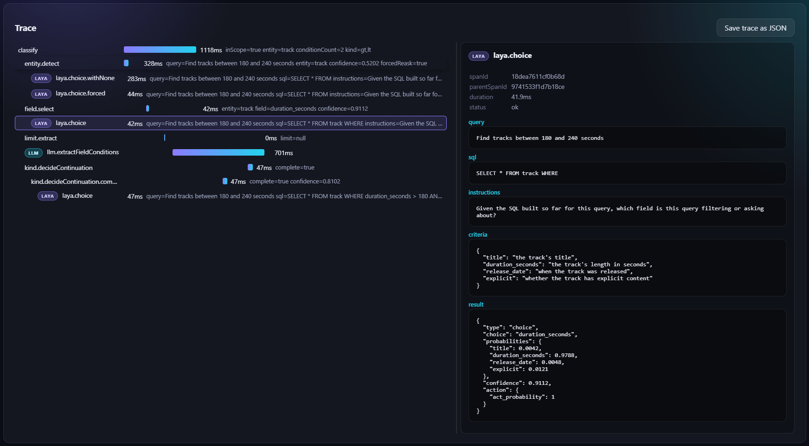

# Architecture

## Layout

| Path | Contents |
|---|---|
| `domains/<name>.json` | Entities, fields, types, descriptions, out-of-scope text for one domain. Source of truth for `schema.generated.ts`. Currently `shop` and `music` — both artificial, built to prove out multi-domain support. |
| `domains/<name>.examples.json` | UI quick-pick examples for that domain, each optionally paired with its expected filter shape (`{query, schema?}`) — also doubles as the benchmark's fixture set for that domain. |
| `packages/laya-client/` | Thin HTTP client for the laya service (`../laya/`, `laya-serve` mode). |
| `packages/llm-client/` | Thin HTTP client for local ollama. |
| `packages/telemetry/` | OTLP-shaped span/trace recording, written to disk (no collector). |
| `packages/domain/` | The actual pipeline — one folder per stage (`entity`, `field`, `kind`, `no-filter`, `value`, `limit`, `clarification`), each <200 LOC. Domain-agnostic. |
| `packages/benchmark/` | Automated benchmark runner + markdown report generator. |
| `apps/api/` | `Bun.serve()` JSON API. |
| `apps/client/` | React + TS manual-test UI with a trace waterfall view. |
| `benchmarks/report-template/` | Committed markdown template. |
| `benchmarks/reports/` | Generated reports (gitignored) — one dated folder per run. |

## How the pipeline works

`classify(query, domainName?)` resolves a `DomainSchema` and threads it to every stage:

1. Looks up `DOMAINS[domainName]` (defaults to `DEFAULT_DOMAIN`, the first domain generated).
2. Puts the resolved schema on `StageContext.domain`.
3. Each stage function (`entity` → `field` → `kind` → `no-filter` → `value` → `limit` → `clarification`) reads entities/fields/descriptions off `ctx.domain` — no module-level import, no shared mutable "current domain" global. That's what makes concurrent requests for different domains safe.

## Domain-aware typing

- `generate:schema` compiles every `domains/<name>.json` into `packages/domain/src/schema.generated.ts`, exporting a `DOMAINS: Record<DomainName, DomainSchema>` registry plus the `DomainName` literal union.
- `schema.ts` re-exports the generated file and `schema-core.ts` (domain-agnostic engine types: `Kind`, `FieldType`, `FilterCondition`, `DomainSchema`, …), so existing `from "./schema"` imports keep working.
- `EntityName` is a plain `string`, not a literal union: different domains have entirely different entities, so one closed type spanning all of them stopped making sense once more than one domain loads at once. Adding a domain still means re-running `generate:schema` and rebuilding — not dropping in a new JSON file at runtime.
- Value extraction (`domain/src/value/deterministic-term.ts`) is keyed by `FieldType` (email/date/number regex), not by field name — a value's literal shape is a property of its type in any domain.

## Tracing

Every stage and every model call is recorded as an OTLP-shaped span:

- `packages/telemetry/` records spans/traces in-memory and writes them to disk — no collector.
- Each stage wraps its work in `withSpan(ctx, "stage.name", …)` (`packages/domain/src/util/with-span.ts`); each laya call is a nested `laya.choice` span, each text-LLM call a nested `llm.*` span.
- The API returns the full trace with the classify response; the client renders it as a waterfall.

| Span list (waterfall) | Span detail pane |
|---|---|
|  |  |

Click a span to inspect its details; the toolbar saves the raw trace as JSON.

## HTTP surface

| Endpoint | Purpose |
|---|---|
| `GET /domains` | Name + label per configured domain |
| `GET /examples?domain=` | That domain's quick-pick examples |
| `POST /classify` | Body `{query, domain}` — classifies the query for that domain |

The client UI has a domain selector that drives both the example list and the classify call.
